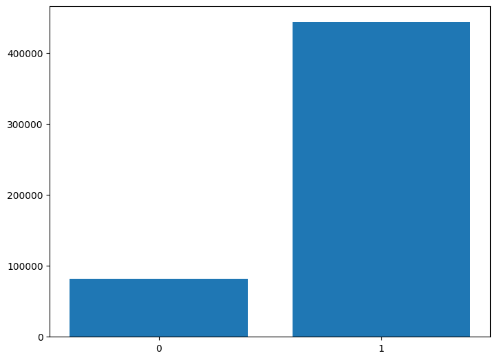

# Advanced Sentiment Analysis with BERT and MLflow

This repository contains a sentiment analysis project that leverages the BERT (Bidirectional Encoder Representations from Transformers) model for generating text embeddings. I have constructed a custom tokenizer for BERT, utilized the embeddings as input to a neural network, and experimented with different network configurations using MLflow. The project includes a TensorFlow callback for computing a custom AUC score, with results visualized in TensorBoard. Finally, a comprehensive data pipeline automates the workflow from raw text data to predictions, and a Flask web application is deployed to classify text reviews as positive or negative.

## Project Structure

1. **BERT Embeddings**: Utilize the BERT model to generate embeddings from text.
2. **Custom BERT Tokenizer**: Implement and integrate a tokenizer tailored for our specific text data.
3. **Neural Network Experimentation**: Use MLflow to track experiments varying in dropout rates and number of layers.
4. **Custom AUC Score**: Implement a custom TensorFlow callback to compute the AUC score during training, visualized through TensorBoard.
5. **Data Pipeline**: Automate the data workflow from input text to model predictions using a robust pipeline.
6. **Flask Web Application**: Deploy a Flask application that uses the trained model to predict and classify review sentiments.

## Setup Instructions

### Prerequisites

- Python 3.8+
- TensorFlow 2.1
- Flask
- MLflow
- sentence-piece

### EDA

 - Training label count distribution 

